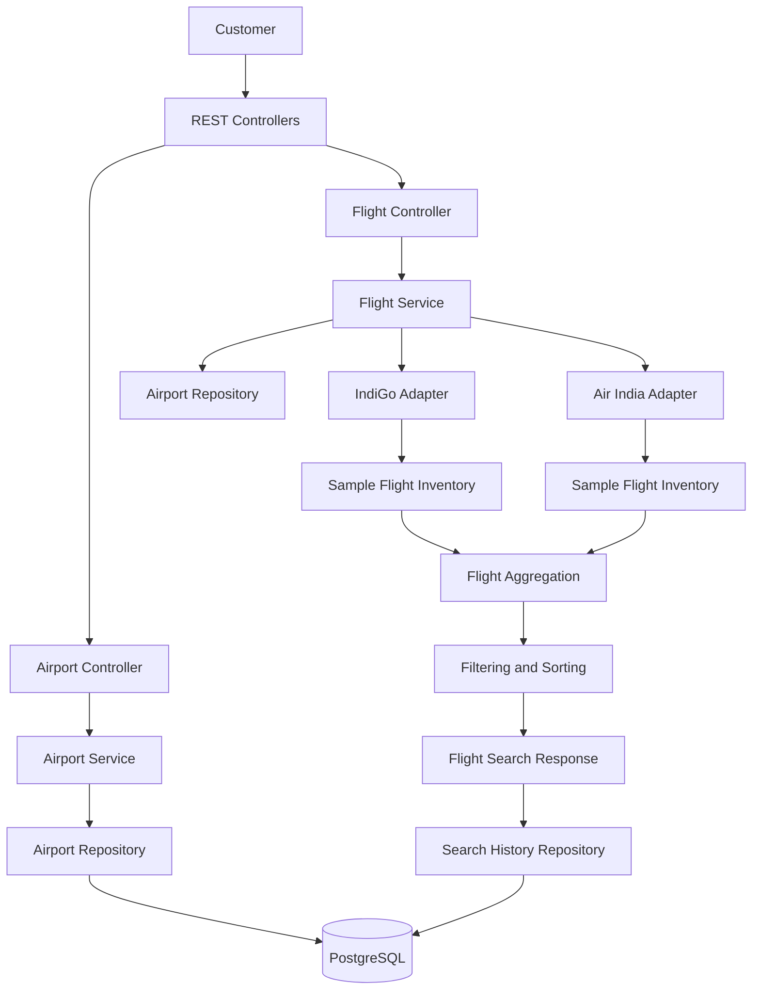
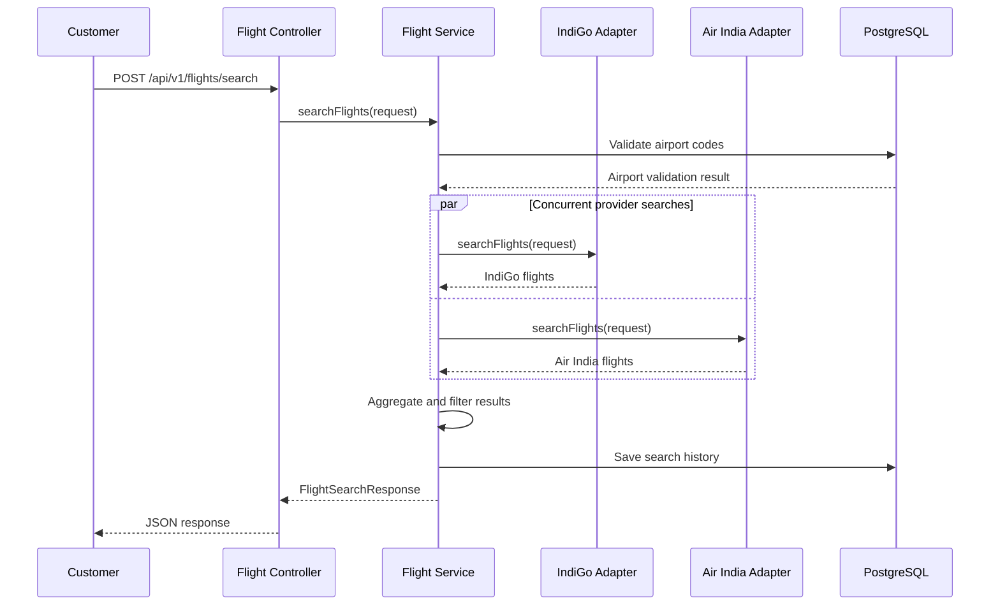

# FlySync – System Architecture

## 1. High-Level Architecture

```mermaid
flowchart TD
    A[Customer] --> B[REST Controllers]

    B --> C[Airport Controller]
    B --> D[Flight Controller]

    C --> E[Airport Service]
    E --> F[Airport Repository]
    F --> G[(PostgreSQL)]

    D --> H[Flight Service]

    H --> I[Airport Repository]
    H --> J[IndiGo Adapter]
    H --> K[Air India Adapter]

    J --> L[Sample Flight Inventory]
    K --> M[Sample Flight Inventory]

    L --> N[Flight Aggregation]
    M --> N

    N --> O[Filtering and Sorting]
    O --> P[Flight Search Response]
    P --> Q[Search History Repository]
    Q --> G
```

## 2. Concurrent Flight Search

```mermaid
sequenceDiagram
    participant C as Customer
    participant FC as Flight Controller
    participant FS as Flight Service
    participant I as IndiGo Adapter
    participant AI as Air India Adapter
    participant DB as PostgreSQL

    C->>FC: POST /api/v1/flights/search
    FC->>FS: searchFlights(request)

    FS->>DB: Validate airport codes
    DB-->>FS: Airport validation result

    par Concurrent provider searches
        FS->>I: searchFlights(request)
        I-->>FS: IndiGo flights
    and
        FS->>AI: searchFlights(request)
        AI-->>FS: Air India flights
    end

    FS->>FS: Aggregate and filter results
    FS->>DB: Save search history
    FS-->>FC: FlightSearchResponse
    FC-->>C: JSON response
```
